# 🚨 Local SIEM Lab with Wazuh, Docker & Ubuntu 24.04

## ✅ Executive Summary

This project demonstrates the deployment of a local Security Information and Event Management (SIEM) lab using Wazuh, Docker, and Ubuntu 24.04 in VirtualBox. It highlights my ability to configure agents, containers, and endpoint monitoring across a simulated environment — all without bootcamp guidance.

By standing up this full security stack from scratch, I showcased hands-on skills in Linux administration, system logging, and open-source SIEM tooling.

---

## ✅ Realism and Business Relevance

- Mirrors tasks expected in SOC and SecOps roles such as agent configuration, threat detection, and log forwarding.
- Wazuh’s MITRE ATT&CK integration reflects enterprise-grade TTP monitoring.
- Demonstrates experience with infrastructure hardening, Docker orchestration, and endpoint security visibility.

---

## 🚀 Future Expansion Opportunities

This project is currently deployed locally, but is structured to scale into AWS with minor changes. Expansion plans include:

- Hosting Wazuh server on an EC2 instance
- Enabling S3-based log collection and archival
- Using Amazon CloudWatch for cross-platform log visibility
- Leveraging AWS Security Hub integration for central threat intel

---

## 🧠 What I Learned

- Installed and configured Docker on Ubuntu using CLI
- Deployed and validated Wazuh SIEM agent and dashboard locally
- Troubleshot systemctl errors and verified running services
- Located agent logs and validated dashboard threat intelligence
- Practiced `ip a`, system updates, and custom `/var/ossec/etc/ossec.conf` edits

---

## 📸 Project Walkthrough

### Ubuntu & Docker Setup

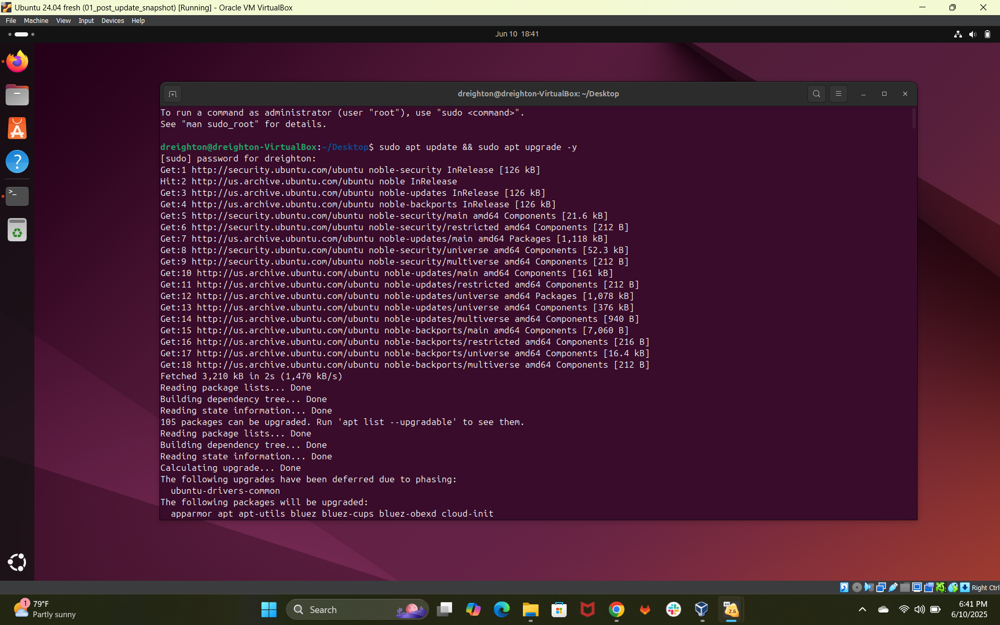
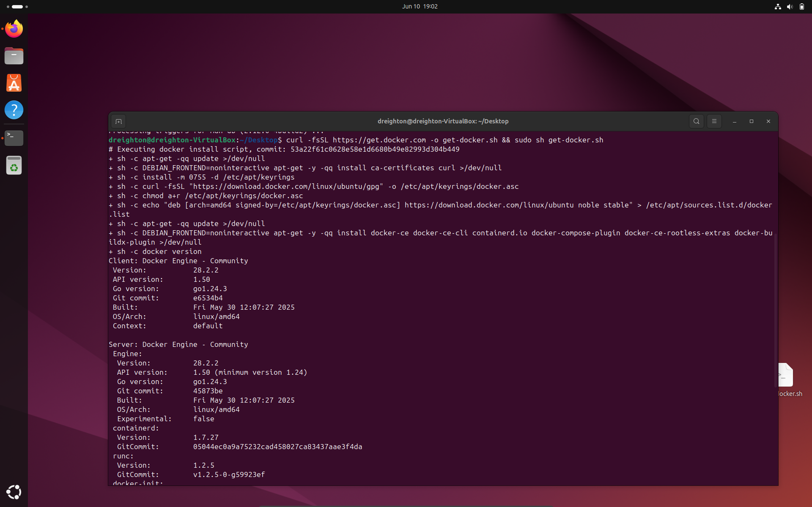
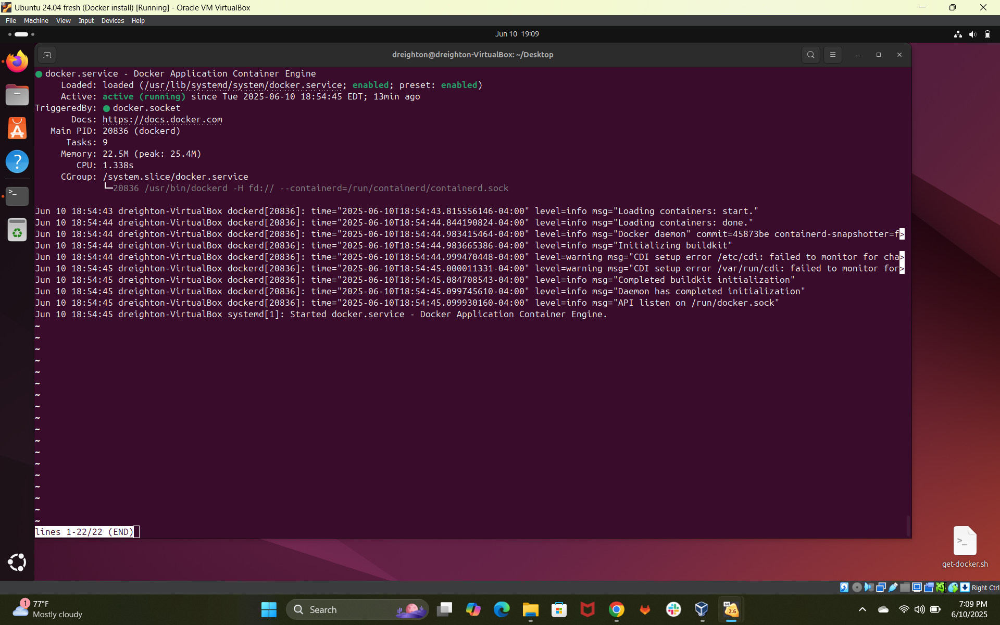
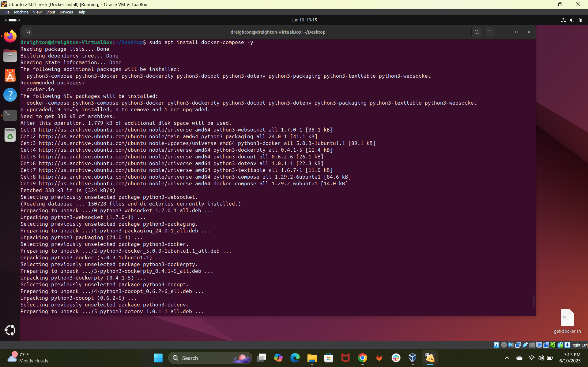
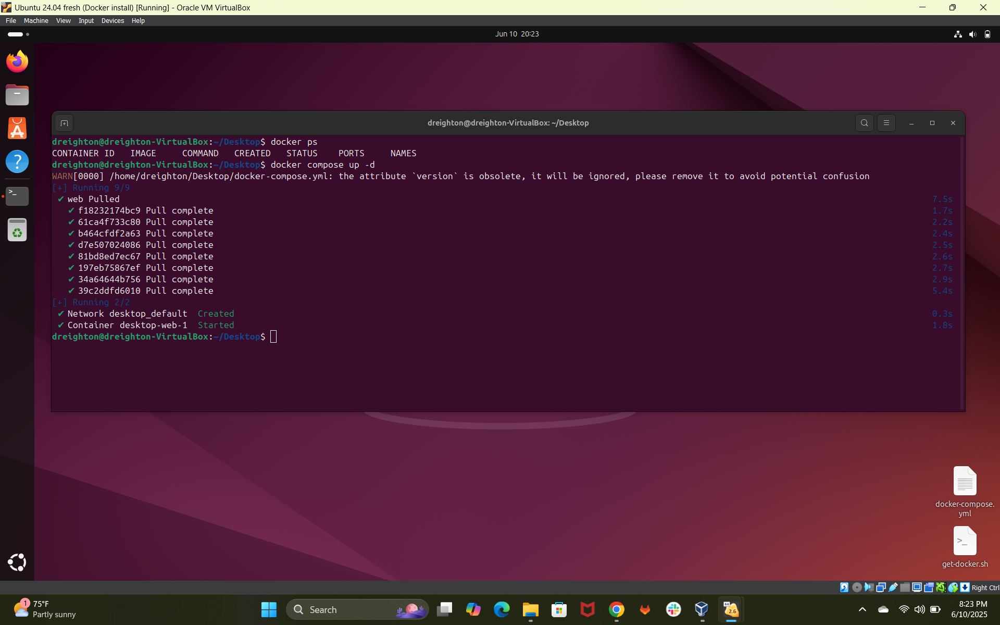
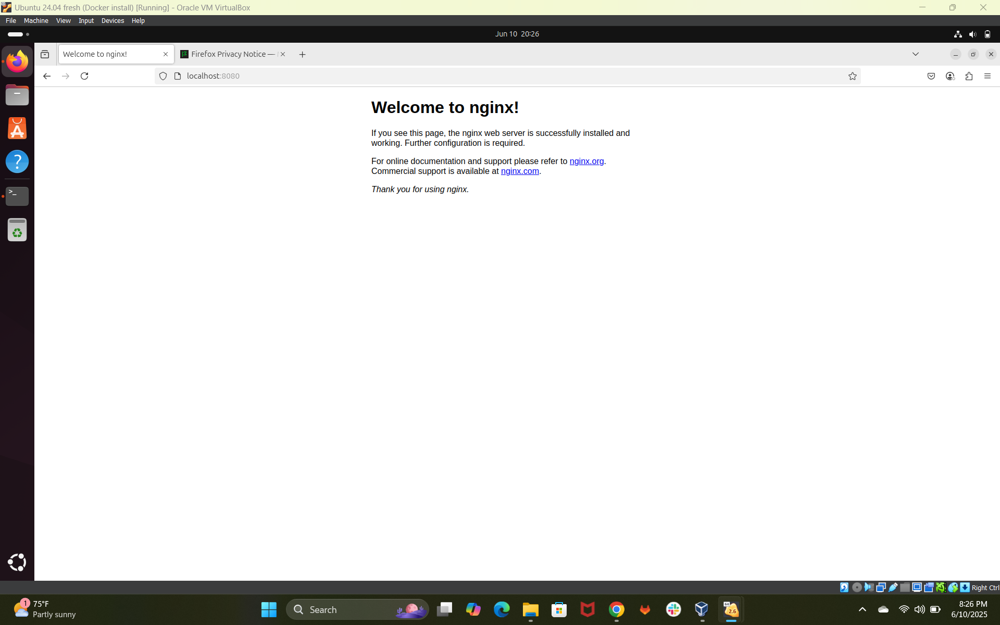

### Wazuh Agent + Server

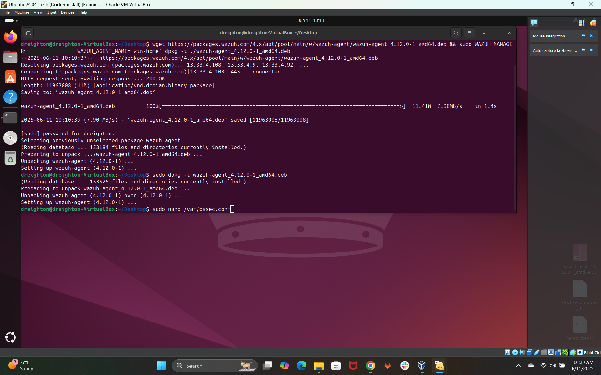
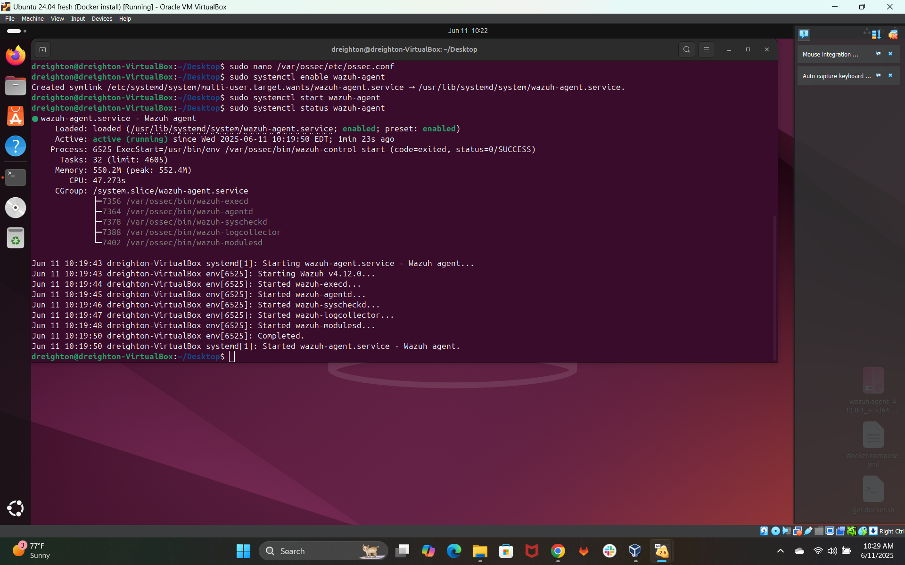
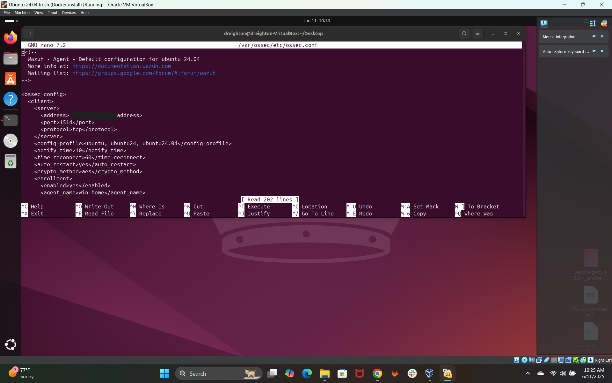
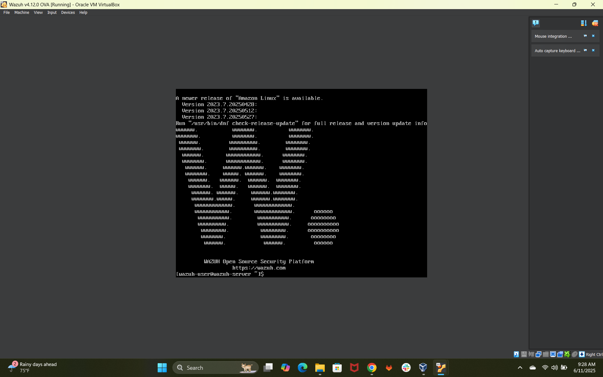
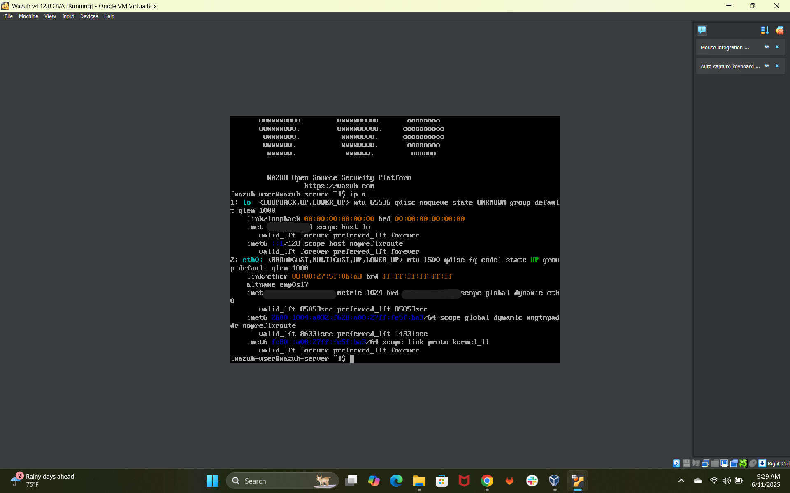
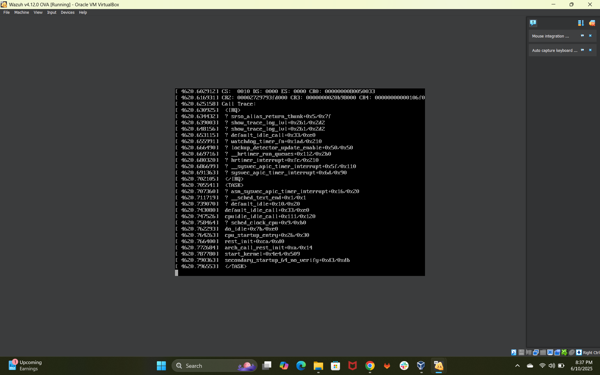

### Wazuh Dashboard

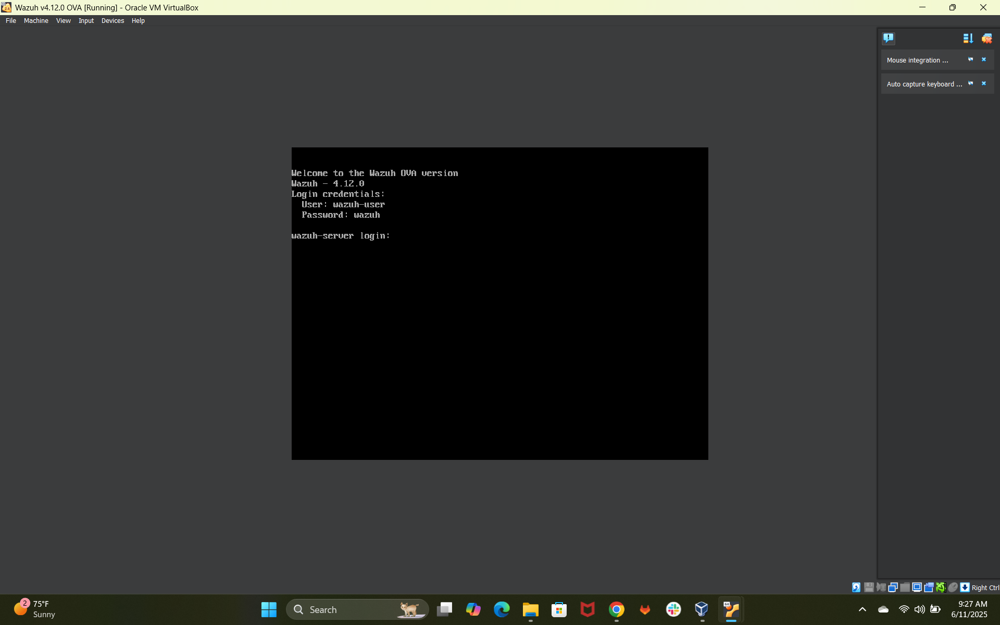
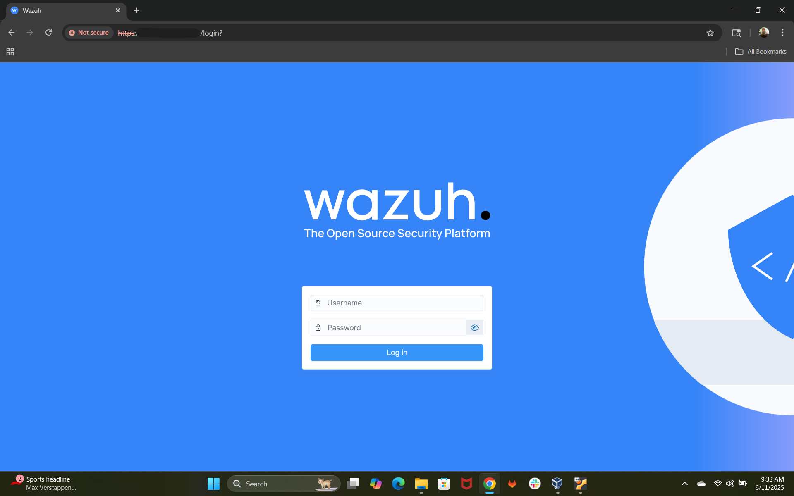
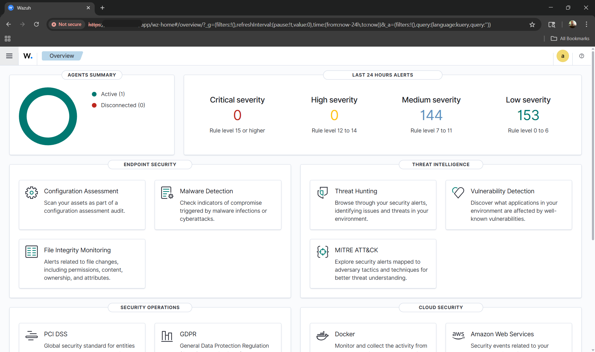

---

## 🛠️ Tools & Technologies

- **OS:** Ubuntu 24.04 via VirtualBox
- **SIEM:** Wazuh v4.12 OVA
- **Containers:** Docker & Docker Compose
- **Monitoring:** Wazuh Dashboard
- **Security Stack:** MITRE ATT&CK, Threat Intelligence, File Integrity Monitoring

---

## 📈 Scalability Beyond Bootcamp

While this project was built post-bootcamp, its structure allows natural growth toward production-like deployment:

- Adding a centralized log shipper like Filebeat
- Building alert pipelines using Elasticsearch or OpenSearch
- Forwarding logs to a cloud SIEM like Chronicle or Azure Sentinel
- Adding compliance rulesets (PCI, NIST, HIPAA) inside Wazuh

---

## ⚠️ Legal Disclaimer

This project was conducted entirely within a locally hosted virtual lab. No public networks or external assets were scanned, breached, or accessed. All screenshots and tools were run in a sandboxed environment for educational purposes only.
